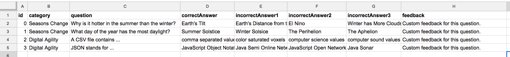

# Display: Custom Feedback Text

If you want to provide special feedback for each trivia question after the answer to provide more information for the player on that quetsion topic, there are two steps.

