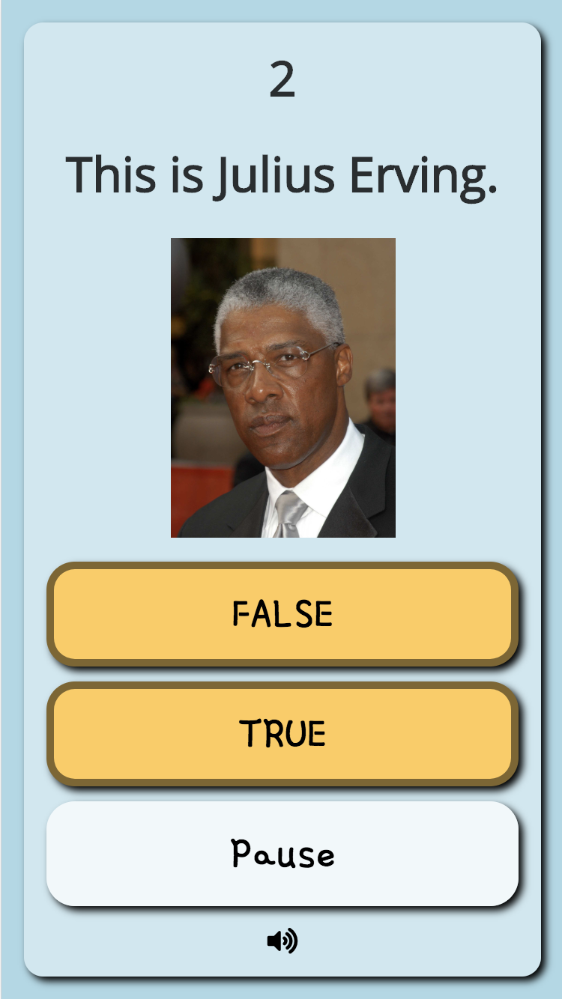

# Add a Question Timer with Pause Button



### HTML

Add the following HTML element inside your question screen section--and probably at the top of the screen. This will be where your timer digits will be displayed.

```markup
<h1 id="timer">-</h1>
```

Add the following HTML element insider your question screen section--possibly at the bottom. This is the button to pause the game.

```markup
<button id="pause-game" onclick="togglePause();">Pause</button>
```

### Javascript

Add the code shown below to your `displayQuestion ( )` function inside the curly braces `{ }` of the function's code block. The Javascript function called `setInterval` runs a block of code at a set interval. In this example, we run a block of code every 100 milliseconds that allows us to update the countdown timer accurately. If the timer reaches zero, it triggers an incorrect answer using `trivia.triggerAnswer(false)`. Notice that you can adjust the time limit by changing the `timeLimit` variable.

```javascript
  $("#pause-game").html("Pause");
  var timeLimit = 10;
  var startTime = Date.now();
  var clock = 10;
  clearInterval(trivia.countDown);
  trivia.isPaused = false;
  trivia.countDown = setInterval(function () {
    if (trivia.state == "question" && !trivia.isPaused) { //ensure the user has not already answered
      var elapsedTime = (Date.now() - startTime) / 1000; //calculate the time elapsed
      clock = timeLimit - Math.floor(elapsedTime);//calculate the countdown w/o decimals
      $('#timer').html(clock);// place the clock time in the html for viewing
      if (clock == 0) { //if time is up
        clearInterval(trivia.countDown); //stops our timer at 0. Don't want -1 ...
        trivia.triggerAnswer(false); //marks the answer as incorrect in trivia library
      }
    }
    else if (!trivia.isPaused) clearInterval(trivia.countDown);
    else {
      timeLimit = clock;
      startTime = Date.now();
    }
  }, 100);//100 is the time interval in milliseconds
```

Add the following function to your Javascript file at the bottom. This will change the pause state of the game and change the text of the button appropriately. Your HTML button runs this function on a click.

```javascript
function togglePause() {
  trivia.isPaused = !trivia.isPaused; //changes pause state
  var btnTxt = trivia.isPaused ? "Resume" : "Pause";
  $("#pause-game").html(btnTxt);
  $(".answer-btn").attr("disabled",trivia.isPaused);//disable answer buttons when paused.
}
```

### CSS

Below is an example of some basic CSS properties you could apply in your stylesheet. Adjust as needed.

```css
#timer{
  text-align: center;
  width: fit-content;
  margin: auto;
}
```

That's it. You should have a functioning timer that you can modify as you wish.

