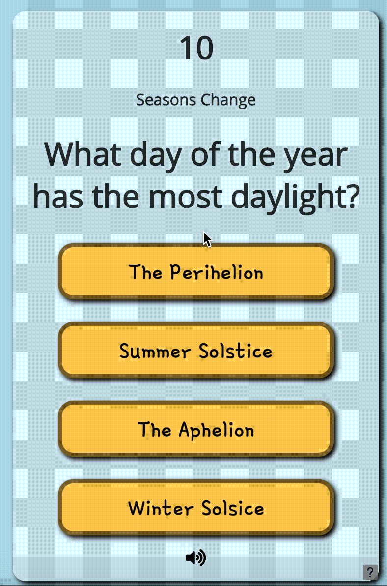

# Add a Question Timer



This is an example of adding a timer to the question screen that counts down to zero.

### HTML

Add the following HTML element inside your question screen section--and probably at the top of the screen. This will be where your timer digits will be displayed.

```markup
<h1 id="timer">-</h1>
```

### Javascript

Add the code shown below to your `displayQuestion ( )` function inside the curly braces `{ }` of the function's code block. The Javascript function called `setInterval` runs a block of code at a set interval. In this example, we run a block of code every 100 milliseconds that allows us to update the countdown timer accurately. If the timer reaches zero, it triggers an incorrect answer using `trivia.triggerAnswer(false)`. Notice that you can adjust the time limit by changing the `timeLimit` variable.

```javascript
var timeLimit = 10;
var startTime = Date.now(); //get the time at the moment a user first sees the question
var countDown = setInterval(function () {
  if (trivia.state == "question") { //ensure the user has not already answered
    var elapsedTime = (Date.now() - startTime)/1000; //calculate the time elapsed
    var clock = timeLimit - Math.floor(elapsedTime);//calculate the countdown w/o decimals
    $('#timer').html(clock);// place the clock time in the html for viewing
    if (clock == 0) { //if time is up
      clearInterval(countDown); //stops our timer at 0. Don't want -1 ...
      trivia.triggerAnswer(false); //marks the answer as incorrect in trivia library
    }
  }
  else clearTimeout(countDown);
}, 100);//100 is the time interval in milliseconds
```

### CSS

Below is an example of some basic CSS properties you could apply in your stylesheet. Adjust as needed.

```css
#timer{
  text-align: center;
  width: fit-content;
  margin: auto;
}
```

That's it. You should have a functioning timer that you can modify as you wish.

