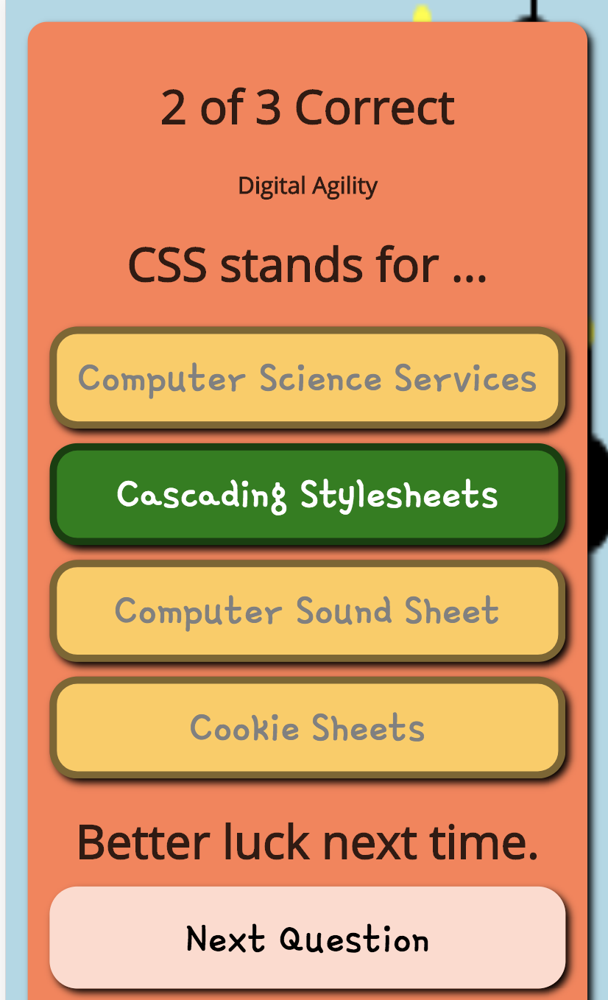

# Add Basic Scoring



The following example code demonstrates how to add basic scoring to your trivia game.

### HTML

Add an HTML element with a unique _id_ that will display the score. For example, you could place the following example to the top of the question screen.

```markup
<h1 id="score">-</h1>
```

### Javascript

Next you will need to update the score presented on the screen at the appropriate time. For starters, place the following line of Javascript inside the curly braces `{ }` of the `onClickedAnswer()` function code block. Placing it at the top of the code block is a good place.

```javascript
$('#score').html(`${trivia.totalCorrect} of ${trivia.totalAnswered} Correct`);
```

That's it, but you will likely want to customize how the score is presented. You could also add the core to the _thank you_ screen in a similar way.

