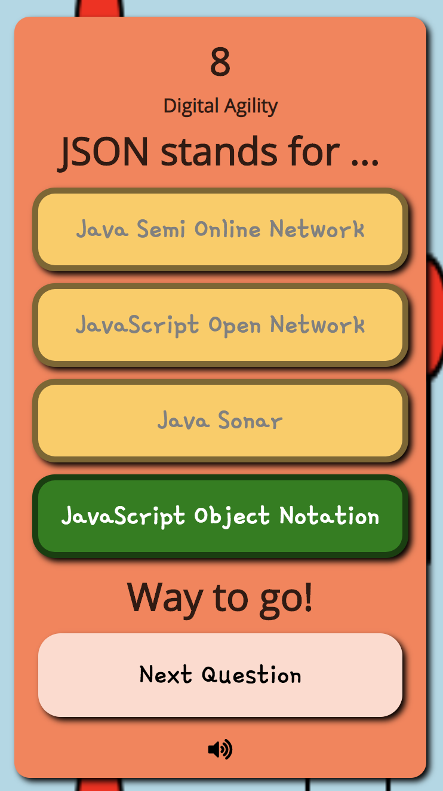

# Add "Next Question" Button



The default trivia template moves the player on to the next question after a few seconds. This example demonstrates how to add a button for the player to click that moves the game along to the next question.

### Javascript Changes

First, find the `onClickedAnswer( )` function. Then locate the following line of code in that function.

```javascript
setTimeout(trivia.gotoNextQuestion, 3000);
```

The code above causes your game to wait 3 seconds before moving on to the next question. Since you will use a button instead, you can either delete this line of code or comment `//` it out.

Next, add the following line of code as a replacement. Notice how an HTML button is appended after your question feedback that responds to a click by running `trivia.gotoNextQuestion()` .

```javascript
$("#feedback").append(`<br><button onclick="trivia.gotoNextQuestion();">Next Question</br>`);
```

That's it. It should work for you. Consider styling this button differently by assigning it a class and adding the new style in your CSS.

