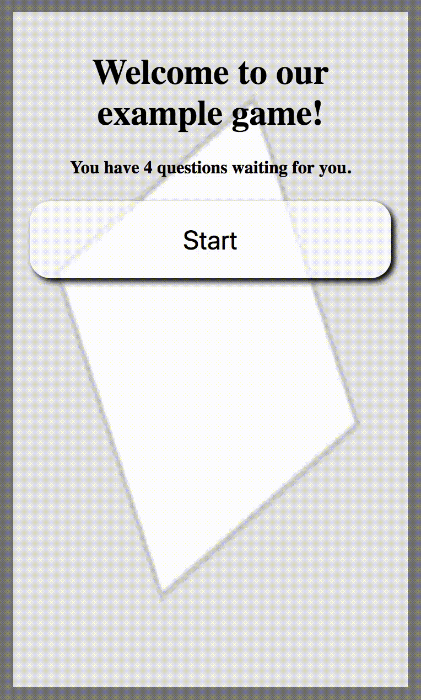
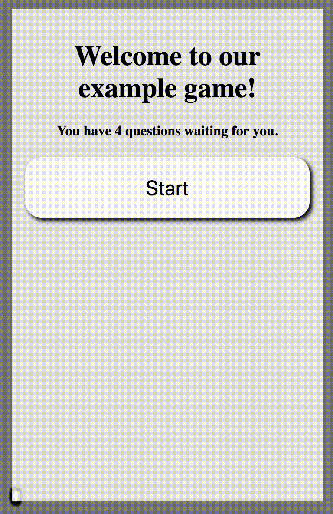
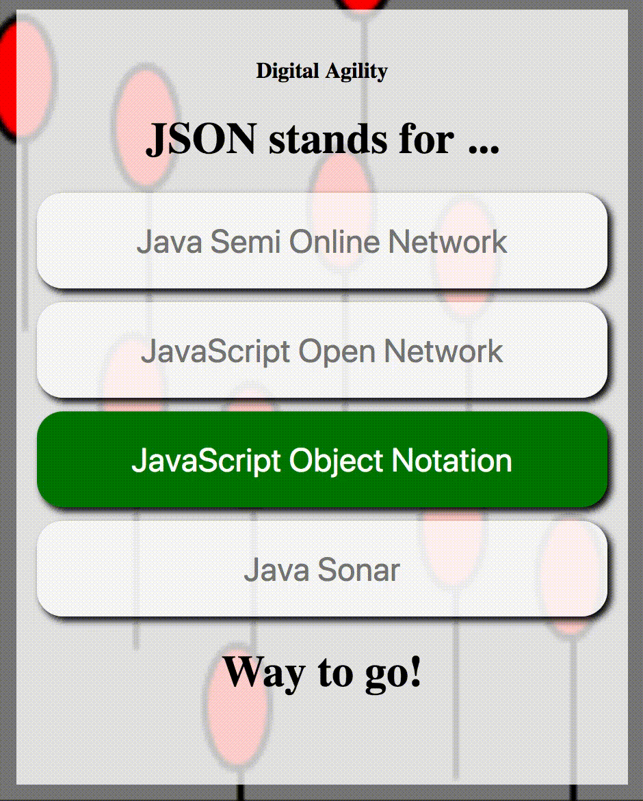

# Add Background Animation

### Spinning Block Example



The function below uses p5.js functions to create a spinning block that you can add to your app background. 

**1 - Add the following function to the bottom of your JavaScript.**



```javascript
function spinningBlock() { 
    background("gray"); 
    translate(width / 2, height / 2); //move to the middle
    rotate(PI / 90 * frameCount); //rotate more with each frame
    rect(-26, -26, 52, 52); //place the rectangle
}
```



**2 - Now you simply need to** _**call**_ **this function when you want it to display in the background.** In the example below, `spinningBlock( )` is called in the `draw( )` function when the trivia game state is "welcome" on line 3. If you want, you can choose to call the function at a different point.



```javascript
//Loops continously for background effects and animations. (p5.js)
function draw() {
  if (trivia.state == "welcome") spinningBlock();
  else if (trivia.state == "question") background("lightblue");
  else if (trivia.state == "correct") background("green");
  else if (trivia.state == "incorrect") background("red");
  else if (trivia.state == "thankyou") background("orange");
}
```




The _spinningBlock_ is a simple example of adding an animation to your background, but you can come up with your own animation and call it something different than `spinningBlock( )`.   
  
For example, you may choose to create an animation that looks like balloons rising up and call it `balloons( )`.  It may be challenging, but you can use functions from the [**p5.js**](https://p5js.org) \(as we did above for the spinning block\) to create some really interesting animations.


### Other Example Animations

**Here are more examples of custom animation functions that could be implemented like the `spinningBlock()` above.**



```javascript
//Just a ball that bounces around on the screen
function ballInBox() {
  background("gray");
  //adjust ball x/y positions based on frameCount
  //and know when to "bounce"
  var x = frameCount%width;
  if (floor(frameCount/width)%2 == 0) x = width - x;
  var y = frameCount*1.3%height;
  if (floor(frameCount*1.3/height)%2 == 0) y = height - y;
  translate(x, y);
  ellipse(0, 0, 3, 3);
}
```



```javascript
//balloons rising to the top
function balloons() {
  background("gray");
  var sFrame = floor(frameCount / (4*height))*4*height; //starting frame for looping
  for (var i = 0; i < 30; i++) { //let's do 30 balloons
    randomSeed(10510 * i + 2); //ensures a repeatable random #
    var y = int(random(height*4) - (frameCount - sFrame)/2);
    randomSeed(30260 * i + 1); //ensures another repeatable random #
    var x = int(random(width));
    fill("red");
    line(x, y, x, y + 30);//balloon string
    ellipse(x, y, 10, 15);//balloon
  }
}
```

