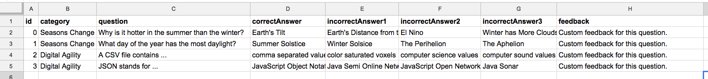

# Custom Feedback Text for Individual Questions

This is an example of how you can provide special feedback for each trivia question after the player answers. For example, you may want to provide more information on that question's topic whether they answered correctly or not.

**1 - Add a "feedback" column to your question spreadsheet \(our database\) like shown below, and add custom feedback text for each question.**



Next, you want to use the trivia property  `trivia.currentQuestion.feedback` to place the text in the HTML element having _id_="feedback". Notice how that is done in lines 2 and 3 below. 

**2 - Make the same changes within your `onClickedAnswer` function in your JavaScript.**



```javascript
function onClickedAnswer(isCorrect) {
  if (isCorrect) $("#feedback").html(trivia.currentQuestion.feedback).show();
  else $("#feedback").html(trivia.currentQuestion.feedback).show();
  $("#correctAnswer").addClass("highlight"); //highlight right answer
  setTimeout(trivia.gotoNextQuestion, 3000); //wait 3 secs...next question
}
```



That's it.

