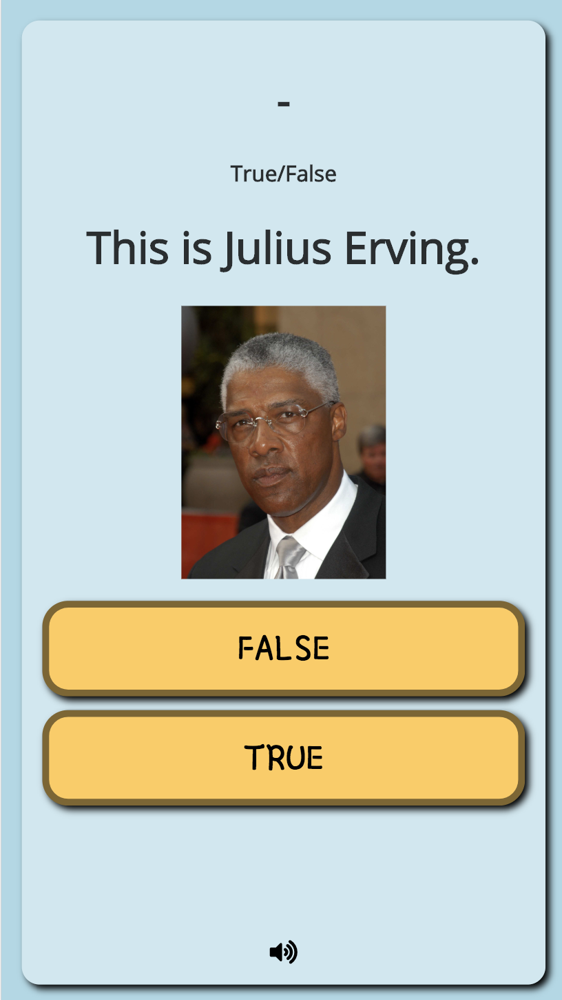
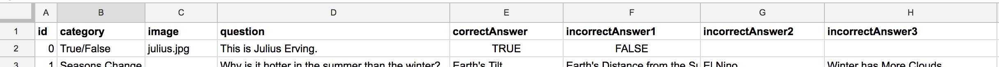

# Use Images with Questions



If you want questions to display a particular image, like shown above, here are the basic steps.

#### 1 - Upload Images to Your App in an "images" folder.

* index.html
* style.css
* code.js
* **images**
  * question1image.png
  * question2image.png

#### 2 - Add a Column in Your Spreadsheet for Image Names



#### 3 - Add HTML to Hold the Image

You may want to place this right below your question, like the example at the top of this page.

```markup
<div id="image-holder"></div>
```

#### 4 - Add the Javascript to Display the Image

You will want to add this right after `trivia.insertQuestionInfo();` in your _displayQuestion\( \)_ function.

```javascript
if (trivia.currentQuestion.image)
    $('#image-holder').html(``);
else 
    $('#image-holder').html(``);
```

#### 5 - Add CSS Styles

These styles will maintain the width of the image and center it on the screen. Change the styles as needed.

```css
#image-holder {
  margin: auto;
  width: 150px;
}

#image-holder > img {
  width: 100%;
}
```

That's it. It should work for you now.

