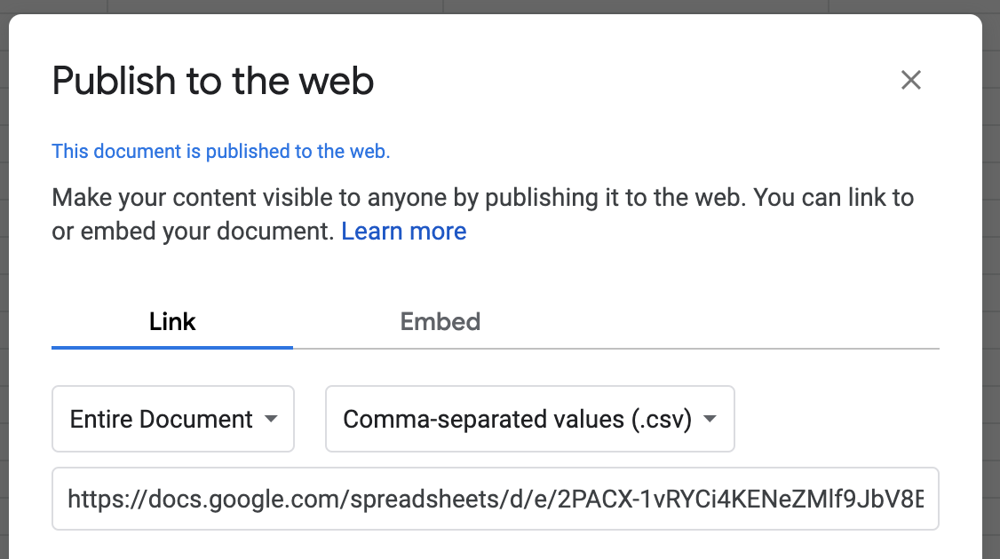

# Managing the Question DB

## Using Google Sheet as Database \(Recommended\)

1. Login to Google Drive.
2. Go to [this spreadsheet](https://docs.google.com/spreadsheets/d/1r58warugRYIwFIAkH2rk4h7OboZnDe1l5C23EXn4nY0/edit?usp=sharing).
3. Create your own copy of the spreadsheet by selecting `File > Make a copy...`.
4. Now publish your copy of the spreadsheet by selecting `File > Publish to the web...` 
5. Choose the Comma-separated value option as shown below.   
6. Click the `Publish` button and copy the full link provided.

   ⚠️ If you are using your school Google account, ensure that you turn off restricting access to your school. If you are using a personal Google account your published link should work fine without needing to do this.  
     

7. Find the setup\(\) function in your JavaScript file, like the example below, and replace your link as the `googleSheetLink`. 
8. Now you can edit your Google Sheet and your question database will automatically be updated in your trivia app.

```javascript
//Runs once at the beginning
function setup() {
  var googleSheetLink = "https://docs.google.com/spreadsheets/d/e/2PACX-1vRYCi4KENeZMlf9JbV8BhVrdOHse2250INSiRo7gEYWUYp3V0jiWFKWcnm1jzx5q1BMsmd9fOopk2Z_/pub?output=csv";
  trivia.loadGoogleSheet(googleSheetLink).then(displayWelcome); 
}
```

